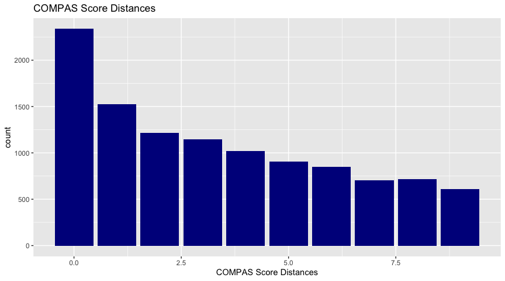
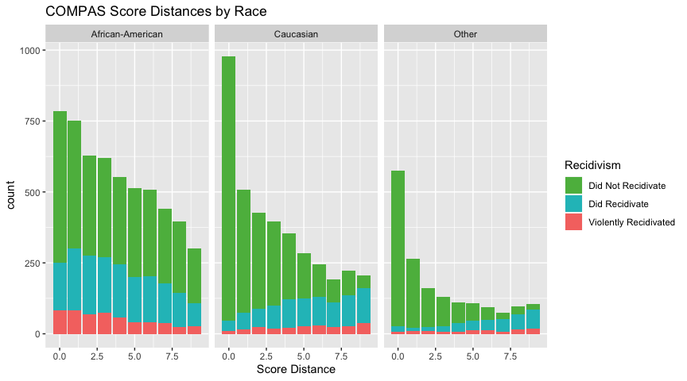
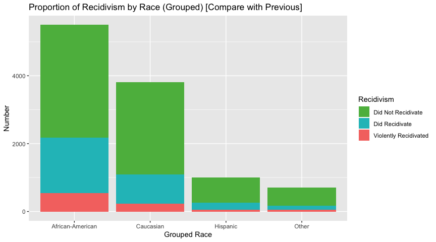
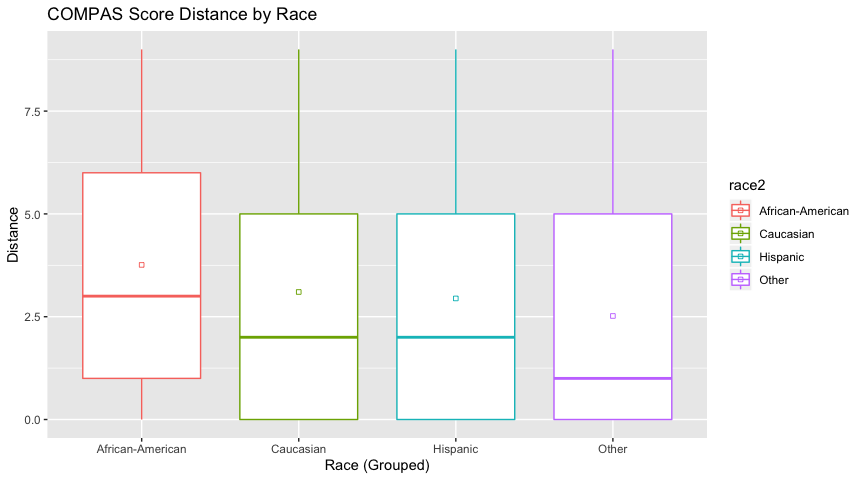
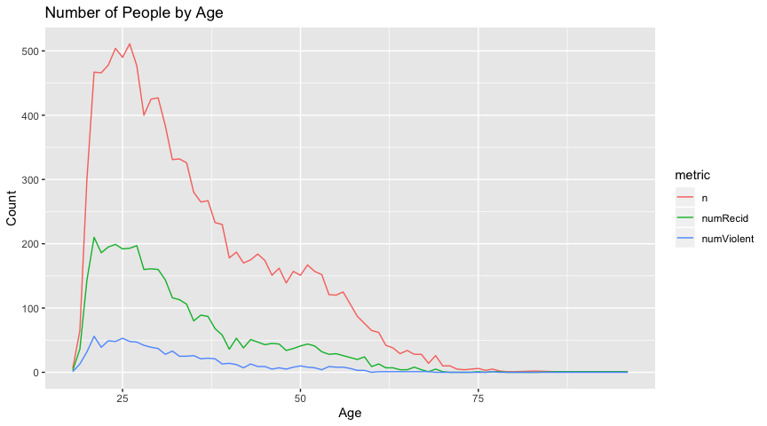
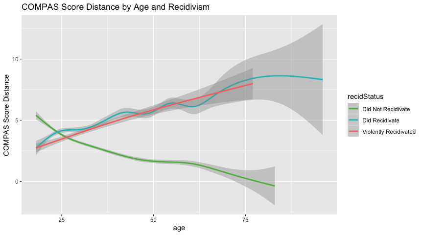
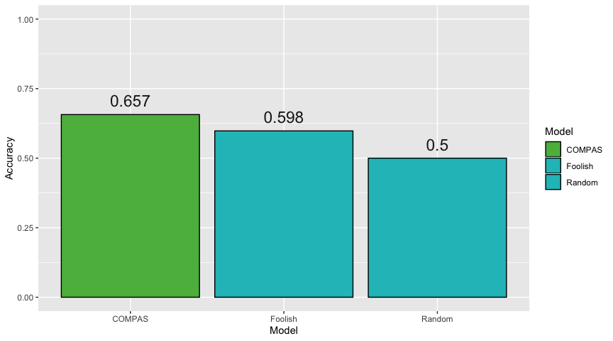
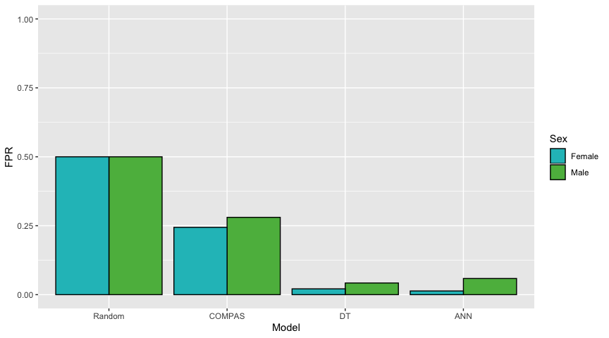

Basic Data Analytics
================
Cameron Kline-Sharpe

# If you modify this code, please add your name to the top of the document, in the author section.

## TODO:

1.  regroup asian, native american with Other for most things
2.  For the sake of comparison with our algorithms, focus on making
    confusion matrix-like graphs
3.  Colors often backwards–pick consistant colors; note also to provide
    colors with correct conotations (red==bad, blue==not)

<!-- --><!-- --><!-- --><!-- --><!-- --><!-- --><!-- --><!-- --><!-- --><!-- --><!-- -->

### CONFUSION MATRIX

| Confusion Matrix   | Score \> 5 | Score \<= 5 |
| ------------------ | ---------- | ----------- |
| Did Recidivate     | 5333       | 1993        |
| Did not Recidivate | 1794       | 1909        |

<!-- --><!-- --><!-- --><!-- --><!-- --><!-- --><!-- -->

<!-- --><!-- --><!-- --><!-- -->

``` r
> 
> 
> simple_COMPAS %>%
+   ggplot( aes(x=recid, fill=predict5Corr)) + 
+     geom_bar() + 
+     scale_fill_manual(values = c("#1FBFC3", "#F57670")) + 
+     labs(title="COMPAS Confusion Matrix", fill="COMPAS Prediction")
```

<!-- -->

``` r
> 
> names <- append(names, "COMPAS")
> accs <- append(accs, accuracy(simple_COMPAS))
> FPRs <- append(FPRs, FPR(simple_COMPAS))
> 
> baseline %>%
+   con_mat() %>%
+   ggplot(aes(x = truthChar, y=n, fill=correct)) + 
+     geom_bar(stat="identity") +
+     labs(title = "Random Baseline for Recidivism",
+          fill="Prediction",
+          x = "Ground Truth",
+          y = "Count") + 
+     scale_fill_manual(values = c("#1FBFC3", "#F57670")) + 
+     geom_text(aes(label = prop, y=n), size = 6, position = position_stack(vjust = 0.5))
```

<!-- -->

``` r
> 
>               
> baseline_violent %>%
+   con_mat() %>%
+   ggplot(aes(x = truthChar, y=n, fill=correct)) + 
+     geom_bar(stat="identity") +
+     labs(title = "Random Baseline for Violent Recidivism",
+          fill="Prediction",
+          x = "Ground Truth",
+          y = "Count") + 
+     scale_fill_manual(values = c("#1FBFC3", "#F57670")) + 
+     geom_text(aes(label = prop, y=n), size = 4, position = position_stack(vjust = 0.5))
```

<!-- -->

``` r
> 
> plot_accs(names, accs) + 
+   scale_fill_manual(values = c(green, blue)) 
```

<!-- -->

``` r
> 
> foolish %>%
+   con_mat() %>%
+   ggplot(aes(x = truthChar, y=n, fill=correct)) + 
+     geom_bar(stat="identity") +
+     labs(title = "Foolish Prediction for Recidivism",
+          fill="Prediction",
+          x = "Ground Truth",
+          y = "Count") + 
+     scale_fill_manual(values = c("#1FBFC3", "#F57670")) + 
+     geom_text(aes(label = prop, y=n), size = 6, position = position_stack(vjust = 0.5))
```

<!-- -->

``` r
> 
> names <- append(names, "Foolish")
> accs <- append(accs, accuracy(foolish))
> FPRs <- append(FPRs, FPR(foolish))
> plot_accs(names, accs) + 
+   scale_fill_manual(values = c(green, blue, blue)) 
```

<!-- -->

``` r
> 
> 
> foolish_violent %>%
+   con_mat() %>%
+   ggplot(aes(x = truthChar, y=n, fill=correct)) + 
+     geom_bar(stat="identity") +
+    
+     labs(title = "Foolish Prediction for Violent Recidivism",
+          fill="Prediction",
+          x = "Ground Truth",
+          y = "Count") + 
+     scale_fill_manual(values = c("#1FBFC3", "#F57670")) + 
+     geom_text(aes(label = prop, y=n), size = 4, position = position_stack(vjust = 0.5))
```

<!-- -->

``` r
> 
> vnames <- append(vnames, "Foolish")
> vaccs <- append(vaccs, accuracy(foolish_violent))
> vTPRs <- append(vTPRs, TPR(foolish_violent))
> vTNRs <- append(vTNRs, TNR(foolish_violent))
> 
> 
```

``` r
> 
> NB <- simple_COMPAS %>%
+   mutate(truth = is_recid) %>%
+   select(truth) %>%
+   mutate(NB = "Did Not Recidivate",
+          truthChar= ifelse(truth == 1, "Did Recidivate", "Did Not Recidivate"),
+          correct = ifelse(truthChar == NB, "Correct", "Incorrect"))
> 
> NB %>%
+   con_mat() %>%
+   ggplot(aes(x = truthChar, y=n, fill=correct)) + 
+     geom_bar(stat="identity") +
+     labs(title = "Naive Bayes Prediction for Recidivism",
+          fill="Prediction",
+          x = "Ground Truth",
+          y = "Count") + 
+     scale_fill_manual(values = c("#1FBFC3", "#F57670")) + 
+     geom_text(aes(label = prop, y=ifelse(n < 500, 500, n)),
+               size = 6, position = position_stack(vjust = 0.5))
```

<!-- -->

``` r
> 
> names <- append(names, "NB")
> accs <- append(accs, accuracy(NB))
> FPRs <- append(FPRs, FPR(NB))
> plot_accs(names, accs) +
+   scale_fill_manual(values = c(green, blue, blue, blue))
```

<!-- -->

``` r
> 
> 
> DT %>%
+   con_mat() %>%
+   ggplot(aes(x = truthChar, y=n, fill=correct)) + 
+     geom_bar(stat="identity") +
+     labs(title = "Decision Tree Prediction for Recidivism",
+          fill="Prediction",
+          x = "Ground Truth",
+          y = "Count") + 
+     scale_fill_manual(values = c("#1FBFC3", "#F57670")) + 
+     geom_text(aes(label = prop, y=ifelse(n < 500, 500, n)),
+               size = 6, position = position_stack(vjust = 0.5))
```

<!-- -->

``` r
> 
> names <- append(names, "DT")
> accs <- append(accs, accuracy(DT))
> FPRs <- append(FPRs, FPR(DT))
> plot_accs(names, accs) +
+   scale_fill_manual(values = c(blue,green, blue, blue, blue))
```

<!-- -->

``` r
> 
> 
> DT_Violent %>%
+   con_mat() %>%
+   ggplot(aes(x = truthChar, y=n, fill=correct)) + 
+     geom_bar(stat="identity") +
+     labs(title = "Decision Prediction for Violent Recidivism",
+          fill="Prediction",
+          x = "Ground Truth",
+          y = "Count") + 
+     scale_fill_manual(values = c("#1FBFC3", "#F57670")) + 
+     geom_text(aes(label = prop, y=ifelse(n < 500, 500, n)),
+               size = 6, position = position_stack(vjust = 0.5))
```

<!-- -->

``` r
> 
> vnames <- append(vnames, "DT")
> vaccs <- append(vaccs, accuracy(DT_Violent))
> vTPRs <- append(vTPRs, TPR(DT_Violent))
> vTNRs <- append(vTNRs, TNR(DT_Violent))
> 
> ANN %>%
+   con_mat() %>%
+   ggplot(aes(x = truthChar, y=n, fill=correct)) + 
+     geom_bar(stat="identity") +
+     labs(title = "ANN Prediction for Recidivism",
+          fill="Prediction",
+          x = "Ground Truth",
+          y = "Count") + 
+     scale_fill_manual(values = c("#1FBFC3", "#F57670")) + 
+     geom_text(aes(label = prop, y=ifelse(n < 500, 500, n)),
+               size = 6, position = position_stack(vjust = 0.5))
```

<!-- -->

``` r
> 
> names <- append(names, "ANN")
> accs <- append(accs, accuracy(ANN))
> FPRs <- append(FPRs, FPR(ANN))
> plot_accs(names, accs) + 
+   scale_fill_manual(values = c(green, blue, blue, blue, blue, blue))
```

<!-- -->

``` r
> 
> 
> plot_accs(names, FPRs) +
+   labs(x = "False Positive Rate")
```

<!-- -->

``` r
> 
> Fair_by_race <- list(Model = c("Random", "Random"),
+              Race = c("White", "Black"),
+              FPR = c(0.5, 0.5)) %>%
+   as.data.frame() %>%
+   as.tbl()
> 
> 
> Fair_by_race <- get_fairness(Fair_by_race, "COMPAS",
+                              FPR(filter(simple_COMPAS, race == "Caucasian")),
+                              FPR(filter(simple_COMPAS, race == "African-American")))
> 
> 
> Fair_by_race <- get_fairness(Fair_by_race, "Foolish",
+                               0.2871621,
+                               0.453757)
> 
> Fair_by_race <- get_fairness(Fair_by_race, "ANN",
+                              FPR(filter(ANN, Caucasian == 1)),
+                              FPR(filter(ANN, `African-American` == 1)))
> 
> 
> Fair_by_race <- get_fairness(Fair_by_race, "DT",
+              FPR(filter(DT, race == "Caucasian")),
+              FPR(filter(DT, race == "African-American")))
> 
> plot_fairness(Fair_by_race)
```

<!-- -->

``` r
> 
> Fair_by_race %>%
+   filter(Model != "Random") %>%
+   spread(Race, FPR) %>%
+   mutate(FPR_Difference = Black - White) %>%
+   ggplot(aes(x = Model, y = FPR_Difference)) +
+     geom_bar(stat = "identity", color = "black",
+              position="dodge", fill = red) +
+     geom_text(aes(label = round(FPR_Difference, 3),
+                   y = FPR_Difference + 0.008),
+               size = 6) +
+     labs(y = "Difference in False Positive Rate")
```

<!-- -->

``` r
> get_sex_fairness <- function(old, model, maleFPR, femaleFPR){
+   new <- list(Model = model, Male = maleFPR, Female = femaleFPR) %>%
+     as.data.frame() %>%
+     gather(Male, Female, key=Sex, value = FPR)
+   data <- rbind(old, new)
+ }
> 
> Sex_fair <- list(Model = c("Random", "Random"),
+              Sex = c("Male", "Female"),
+              FPR = c(0.5, 0.5)) %>%
+   as.data.frame() %>%
+   as.tbl()
> 
> Sex_fair <-  get_sex_fairness(Sex_fair, "COMPAS",
+              FPR(filter(simple_COMPAS, sex == "Male")),
+              FPR(filter(simple_COMPAS, sex == "Female")))
> 
> Sex_fair <-  get_sex_fairness(Sex_fair, "DT",
+              FPR(filter(DT, sex == "Male")),
+              FPR(filter(DT, sex == "Female")))
> 
> Sex_fair <-  get_sex_fairness(Sex_fair, "ANN",
+              FPR(filter(ANN, Male == 1)),
+              FPR(filter(ANN, Female == 1)))
> 
> ggplot(Sex_fair, aes(x=Model, y=FPR, fill = Sex)) +
+     geom_bar(stat = "identity", color = "black", position="dodge") +
+     scale_fill_manual(values = c(blue, green)) +
+     ylim(0,1)
```

<!-- -->

``` r
> 
> # African American 
> 
> b_vs_w <- simple_COMPAS %>%
+   filter(race %in%  c("Caucasian", "African-American")) %>%
+   select(race,decile_score)
> 
> b_vs_everyone <- simple_COMPAS %>%
+   mutate(not_black = ifelse(race == "African-American", "AA", "Other")) %>%
+   select(not_black, decile_score)
> 
> boot(decile_score ~ race, b_vs_w) # 95 % CI = 1.563831 1.782578 (AA _ C)
> 
> boot(decile_score ~ not_black, b_vs_everyone) #  95 % CI =  1.728979 1.933784 (AA - E)
> 
> # Hispanic
> 
> h_vs_w <- simple_COMPAS %>%
+   filter(race %in%  c("Caucasian", "Hispanic")) %>%
+   select(race,decile_score)
> 
> h_vs_everyone <- simple_COMPAS %>%
+   mutate(not_black = ifelse(race == "Hispanic", "H", "Other")) %>%
+   select(not_black, decile_score)
> 
> 
> boot(decile_score ~ race, h_vs_w) # 95 % CI = 0.1633147 0.5171069 (C - H)
> 
> boot(decile_score ~ not_black, h_vs_everyone) #  95 % CI =  -1.377856 -1.036370 (H - E)
> 
> # Age ranges
> 
> age_groups <- simple_COMPAS %>%
+   mutate(ageYoung = ifelse(age <= 35, "Y", "O"), ageOld = ifelse(age >= 55, "O", "Y")) %>%
+   select(ageYoung, ageOld, decile_score)
> 
> boot(decile_score ~ ageYoung, age_groups) #  95 % CI =  -2.061035 -1.854572 (O - Y)
> 
> boot(decile_score ~ ageOld, age_groups) #  95 % CI =  -2.152014 -1.815392 (O - Y)
> 
> 
```
