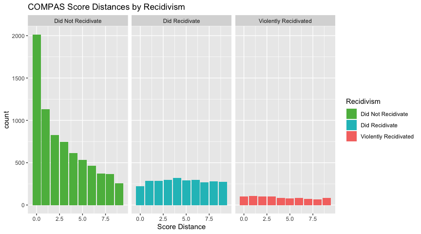
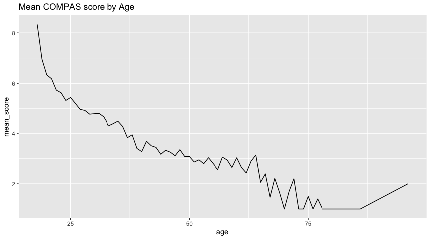

Basic Data Analytics
================
Cameron Kline-Sharpe

# If you modify this code, please add your name to the top of the document, in the author section.

## TODO:

1.  regroup asian, native american with Other for most things
2.  For the sake of comparison with our algorithms, focus on making
    confusion matrix-like graphs
3.  Colors often backwards–pick consistant colors; note also to provide
    colors with correct conotations (red==bad, blue==not)

<!-- --><!-- --><!-- --><!-- -->

### CONFUSION MATRIX

| Confusion Matrix   | Score \> 5 | Score \<= 5 |
| ------------------ | ---------- | ----------- |
| Did Recidivate     | 5333       | 1993        |
| Did not Recidivate | 1794       | 1909        |

<!-- --><!-- --><!-- -->

<!-- --><!-- --><!-- -->

<!-- --><!-- --><!-- -->
