Basic Data Analytics
================
Cameron Kline-Sharpe

If you modify this code, please add your name to the top of the document, in the author section.
================================================================================================

TODO:
-----

1.  regroup asian, native american with Other for most things
2.  For the sake of comparison with our algorithms, focus on making confusion matrix-like graphs
3.  Colors often backwards--pick consistant colors; note also to provide colors with correct conotations (red==bad, blue==not)

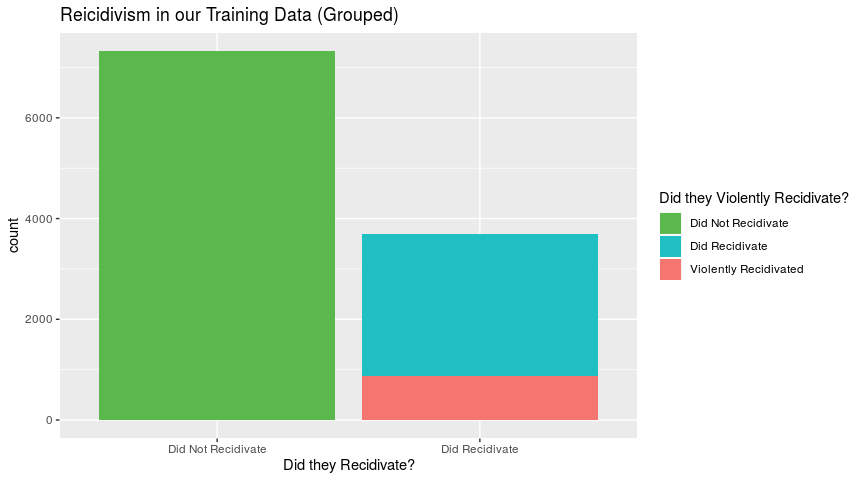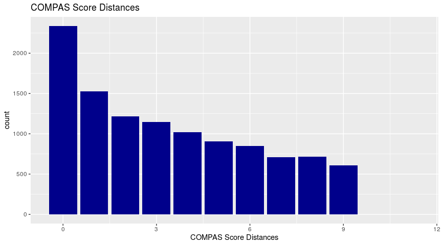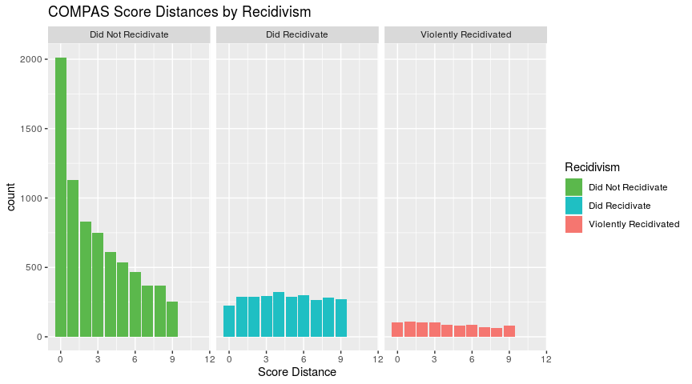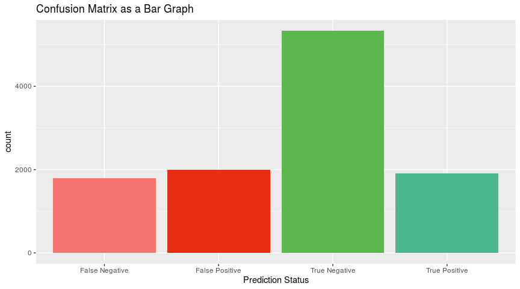

### CONFUSION MATRIX

| Confusion Matrix   | Score &gt; 5 | Score &lt;= 5 |
|--------------------|--------------|---------------|
| Did Recidivate     | 5333         | 1993          |
| Did not Recidivate | 1794         | 1909          |

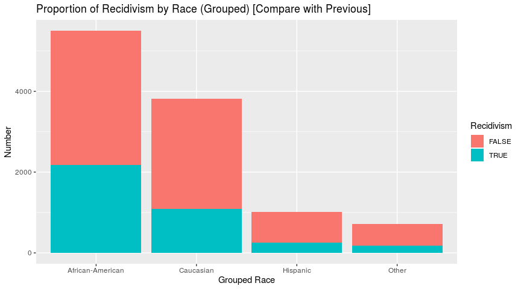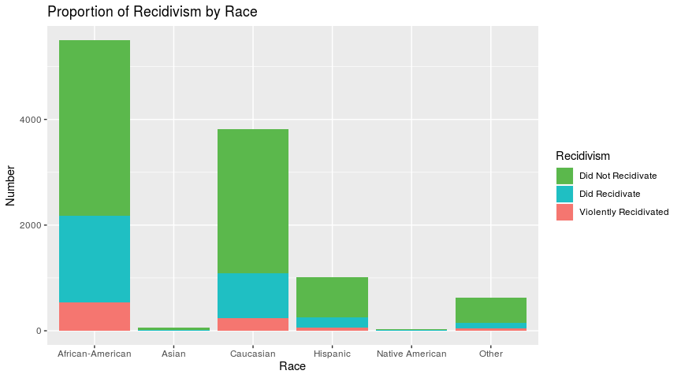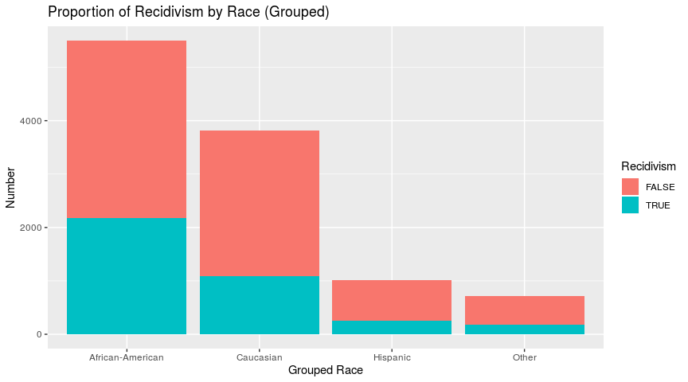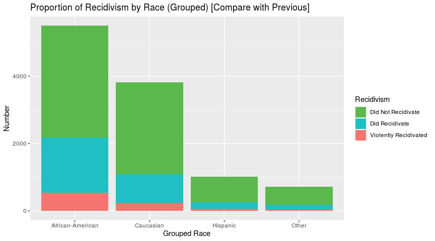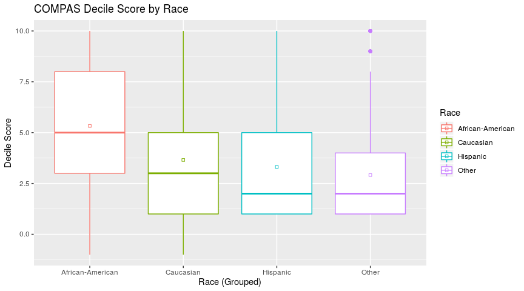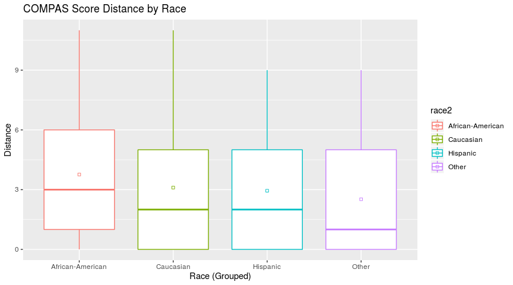

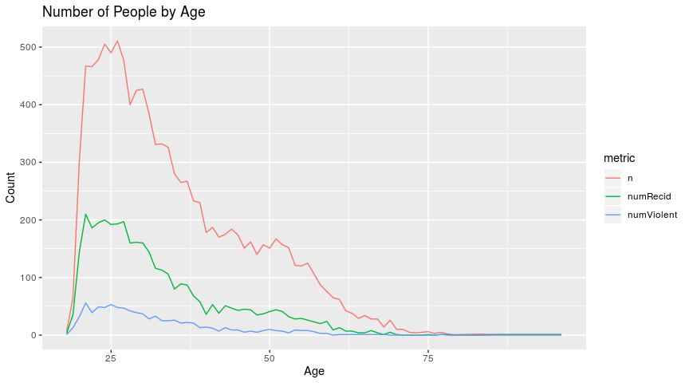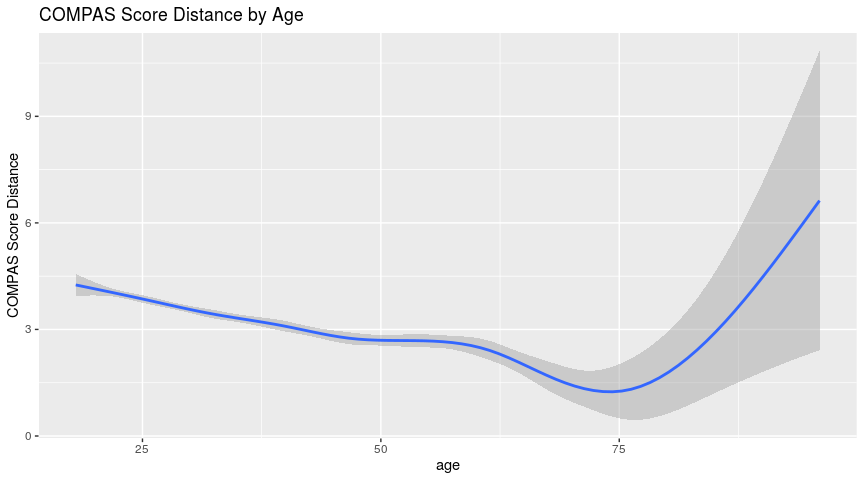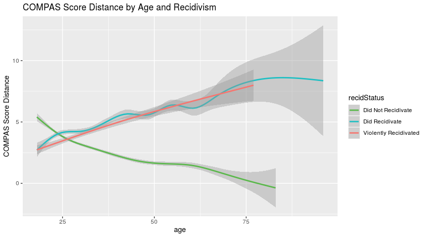

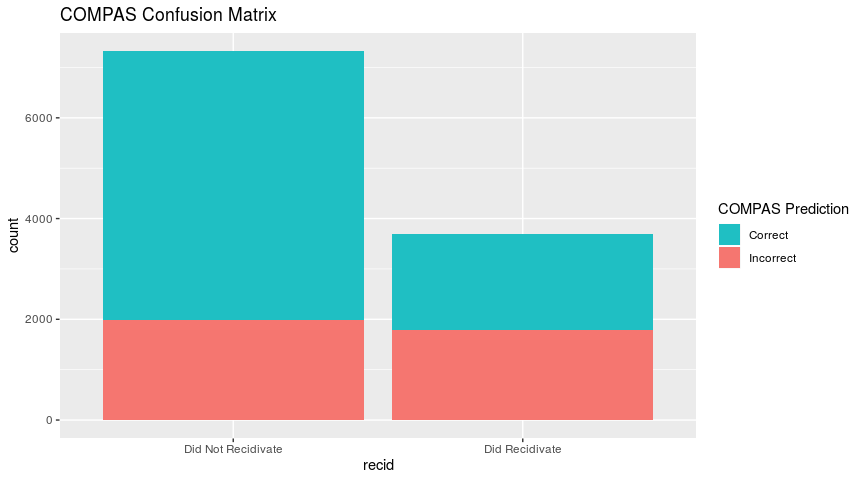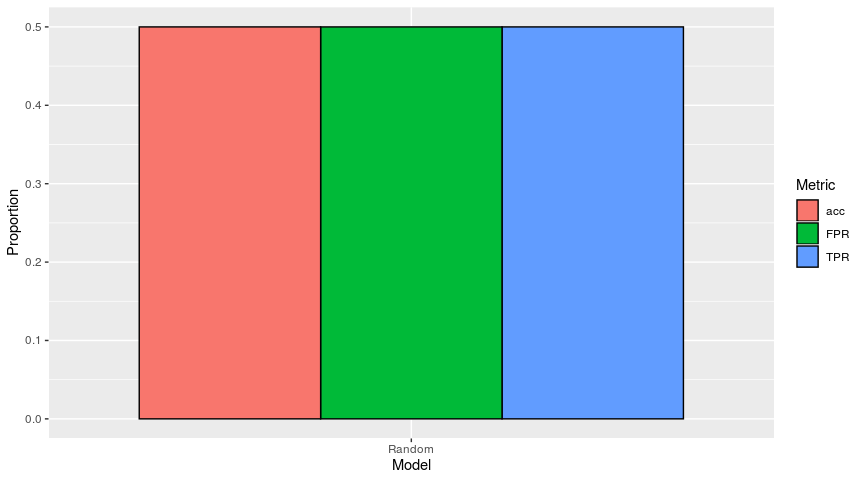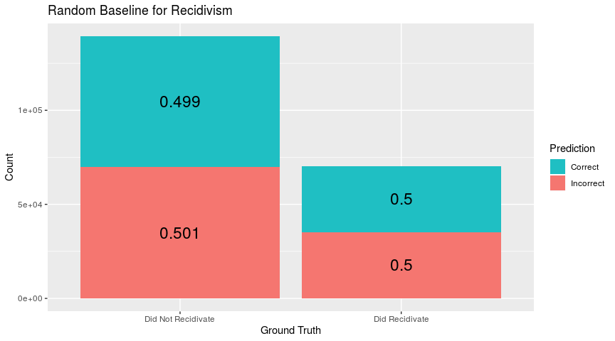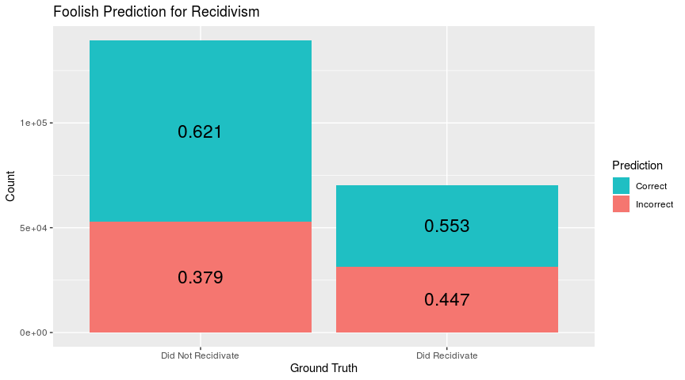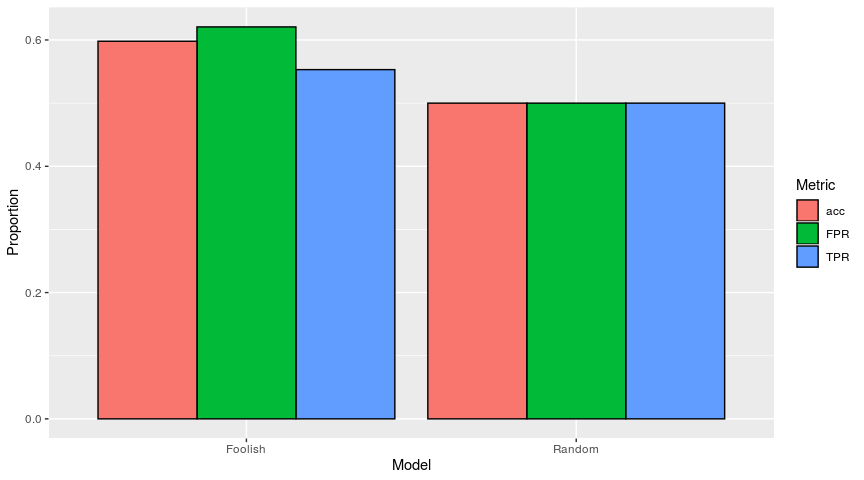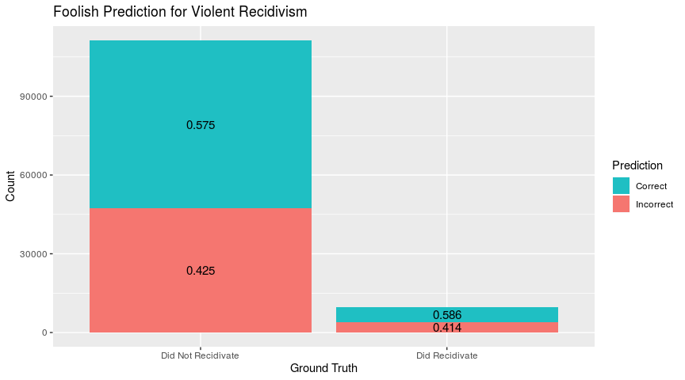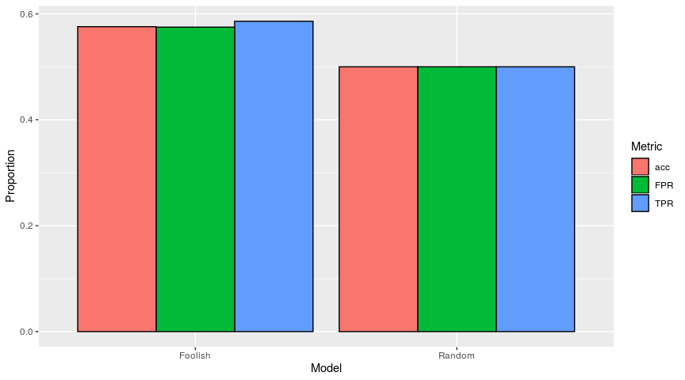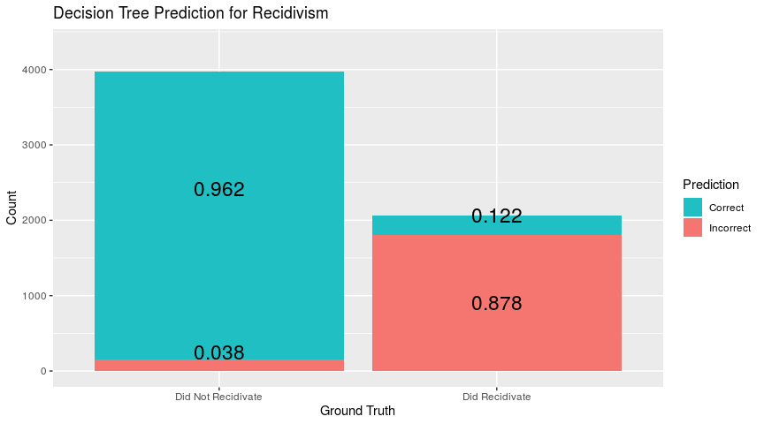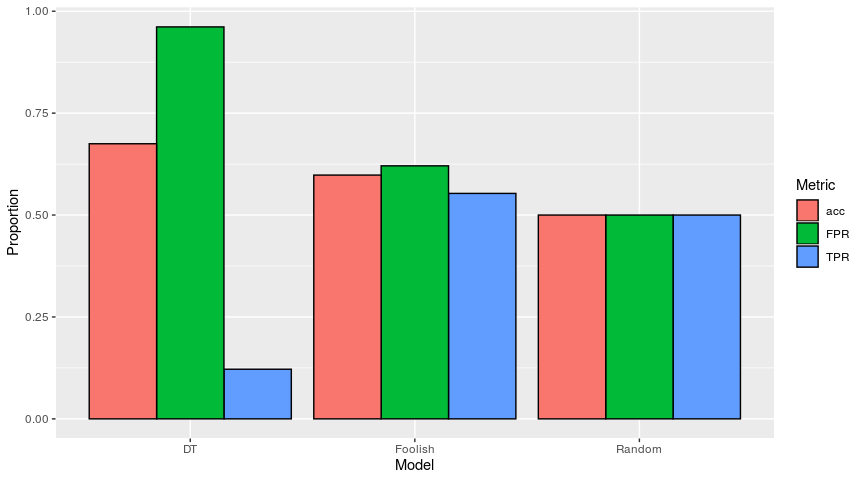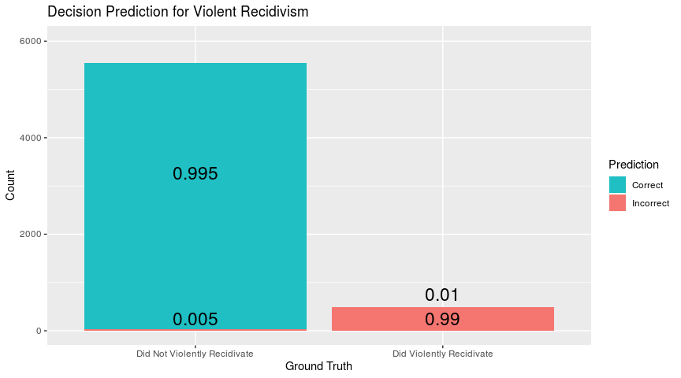

``` r
> 
> # African American 
> 
> b_vs_w <- simple_COMPAS %>%
+   filter(race %in%  c("Caucasian", "African-American")) %>%
+   select(race,decile_score)
> 
> b_vs_everyone <- simple_COMPAS %>%
+   mutate(not_black = ifelse(race == "African-American", "AA", "Other")) %>%
+   select(not_black, decile_score)
> 
> boot(decile_score ~ race, b_vs_w) # 95 % CI = 1.563831 1.782578 (AA _ C)
> 
> boot(decile_score ~ not_black, b_vs_everyone) #  95 % CI =  1.728979 1.933784 (AA - E)
> 
> # Hispanic
> 
> h_vs_w <- simple_COMPAS %>%
+   filter(race %in%  c("Caucasian", "Hispanic")) %>%
+   select(race,decile_score)
> 
> h_vs_everyone <- simple_COMPAS %>%
+   mutate(not_black = ifelse(race == "Hispanic", "H", "Other")) %>%
+   select(not_black, decile_score)
> 
> 
> boot(decile_score ~ race, h_vs_w) # 95 % CI = 0.1633147 0.5171069 (C - H)
> 
> boot(decile_score ~ not_black, h_vs_everyone) #  95 % CI =  -1.377856 -1.036370 (H - E)
> 
> # Age ranges
> 
> age_groups <- simple_COMPAS %>%
+   mutate(ageYoung = ifelse(age <= 35, "Y", "O"), ageOld = ifelse(age >= 55, "O", "Y")) %>%
+   select(ageYoung, ageOld, decile_score)
> 
> boot(decile_score ~ ageYoung, age_groups) #  95 % CI =  -2.061035 -1.854572 (O - Y)
> 
> boot(decile_score ~ ageOld, age_groups) #  95 % CI =  -2.152014 -1.815392 (O - Y)
> 
> 
```
