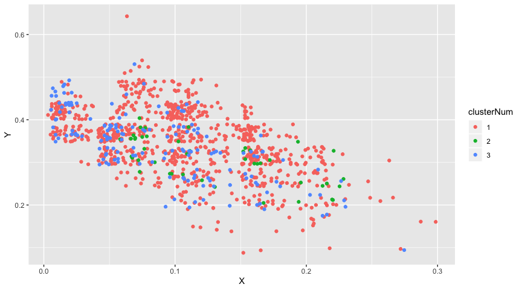
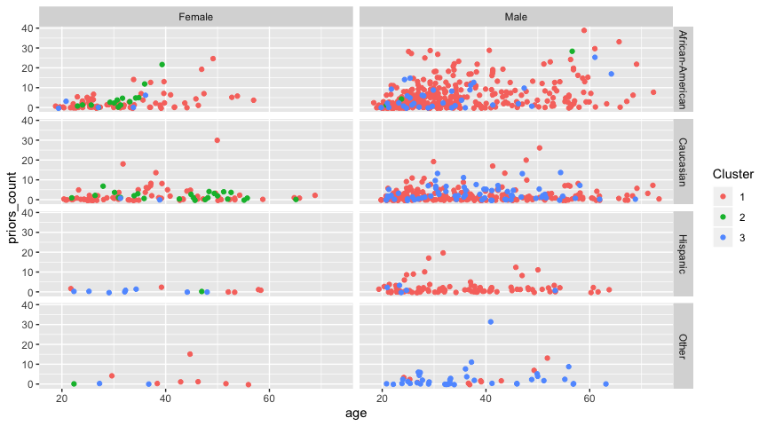

Basic Data Analytics
================
Cameron Kline-Sharpe

# The best heat maps are at the very bottom

TO CHANGE THE CLUSTERS THIS RUNS ON: Go to the `getClusters` code chunk
(it’s the third one down from the top), and change the file names inside
the `read_csv()` functions.

TO CHANGE THE WAY THE HEAT MAP WORKS: Go to the `graphClusters` code
chunk (it’s the second to last one), see the comments

``` r
> #                  Change the filenames below to read in different clusters
> cluster31 <- read_csv("AverageLinkTrainDataCluster3_1.csv") %>%
+     mutate(age_group = ifelse(age < 35, "age<35", ifelse(age < 60, "age<60", "60<age")),
+            clusterNum = "1")
> cluster32 <- read_csv("AverageLinkTrainDataCluster3_2.csv") %>%
+     mutate(age_group = ifelse(age < 35, "age<35", ifelse(age < 60, "age<60", "60<age")),
+            clusterNum = "2")
> cluster33 <- read_csv("AverageLinkTrainDataCluster3_3.csv") %>%
+     mutate(age_group = ifelse(age < 35, "age<35", ifelse(age < 60, "age<60", "60<age")),
+            clusterNum = "3")
```

``` r
> get_recid_counts <- function(clusterNum) {
+   if (clusterNum == 1){
+     data <- cluster31
+   } else {
+     if (clusterNum == 2) {
+       data <- cluster32
+     } else {
+       data <- cluster33
+     }
+   }
+   data %>%
+     mutate(clusterNum = clusterNum) %>%
+     group_by(clusterNum, is_recid) %>%
+     summarise(n = n()) %>%
+     group_by(clusterNum) %>%
+     mutate(propRecid = n/sum(n))
+ }
> nums <- seq(1, 3, by=1)
> numRecids <- map_df(nums, get_recid_counts) %>%
+   group_by(is_recid) %>%
+   mutate(propRecidDiff = round(propRecid-mean(propRecid), 4), propRecidDiffProp = round((propRecid-mean(propRecid))/propRecid,4))
> numRecids
# A tibble: 6 x 6
# Groups:   is_recid [2]
  clusterNum is_recid     n propRecid propRecidDiff propRecidDiffProp
  <chr>         <dbl> <int>     <dbl>         <dbl>             <dbl>
1 1                 0   563     0.672        0.0025            0.0038
2 1                 1   275     0.328       -0.0025           -0.0077
3 2                 0    29     0.659       -0.0102           -0.0155
4 2                 1    15     0.341        0.0102            0.03  
5 3                 0   109     0.677        0.0077            0.0114
6 3                 1    52     0.323       -0.0077           -0.0238
```

``` r
> get_race_counts <- function(clusterNum) {
+   if (clusterNum == 1){
+     data <- cluster31
+   } else {
+     if (clusterNum == 2) {
+       data <- cluster32
+     } else {
+       data <- cluster33
+     }
+   }
+   data %>%
+     mutate(clusterNum = clusterNum) %>%
+     group_by(clusterNum, race) %>%
+     summarise(n = n()) %>%
+     group_by(clusterNum) %>%
+     mutate(propRace = n/sum(n))
+ }
> 
> numRace <- map_df(nums, get_race_counts) %>%
+   group_by(race) %>%
+   mutate(propRaceDiff = round(propRace-mean(propRace), 4), propRaceDiffProp = round((propRace-mean(propRace))/propRace,4))
> numRace
# A tibble: 12 x 6
# Groups:   race [4]
   clusterNum race                 n propRace propRaceDiff propRaceDiffProp
   <chr>      <chr>            <int>    <dbl>        <dbl>            <dbl>
 1 1          African-American   449   0.536        0.140            0.262 
 2 1          Caucasian          281   0.335       -0.0991          -0.295 
 3 1          Hispanic            91   0.109        0.0379           0.349 
 4 1          Other               17   0.0203      -0.0789          -3.89  
 5 2          African-American    18   0.409        0.0134           0.0327
 6 2          Caucasian           24   0.545        0.111            0.204 
 7 2          Hispanic             1   0.0227      -0.048           -2.11  
 8 2          Other                1   0.0227      -0.0765          -3.37  
 9 3          African-American    39   0.242       -0.154           -0.634 
10 3          Caucasian           68   0.422       -0.012           -0.0285
11 3          Hispanic            13   0.0807       0.0101           0.125 
12 3          Other               41   0.255        0.155            0.610 
```

``` r
> get_age_counts <- function(clusterNum) {
+   if (clusterNum == 1){
+     data <- cluster31
+   } else {
+     if (clusterNum == 2) {
+       data <- cluster32
+     } else {
+       data <- cluster33
+     }
+   }
+   data %>% as.tbl() %>%
+     mutate(clusterNum = clusterNum) %>%
+     group_by(clusterNum, age_group) %>%
+     summarise(n = n()) %>%
+     group_by(clusterNum) %>%
+     mutate(propAge = n/sum(n))
+ }
> 
> 
> numRace <- map_df(nums, get_age_counts) %>%
+   group_by(age_group) %>%
+   mutate(propAgeDiff = round(propAge-mean(propAge), 4), propAgeDiffProp = round((propAge-mean(propAge))/propAge,4))
> numRace 
# A tibble: 9 x 6
# Groups:   age_group [3]
  clusterNum age_group     n propAge propAgeDiff propAgeDiffProp
  <chr>      <chr>     <int>   <dbl>       <dbl>           <dbl>
1 1          60<age       34  0.0406      0.0091          0.225 
2 1          age<35      496  0.592       0.0457          0.0773
3 1          age<60      308  0.368      -0.0548         -0.149 
4 2          60<age        1  0.0227     -0.0087         -0.384 
5 2          age<35       22  0.5        -0.0462         -0.0923
6 2          age<60       21  0.477       0.0549          0.115 
7 3          60<age        5  0.0311     -0.0004         -0.0128
8 3          age<35       88  0.547       0.0004          0.0008
9 3          age<60       68  0.422       0              -0.0001
```

``` r
> get_df <- function(data){
+   data %>%
+     as.data.frame()
+ }
> 
> get_numeric <- function(data, default){
+   min <- min(data)
+   max <- max(data)
+   range <- max-min
+   dist <- (data - data[[default]])/range
+ }
> 
> clusters <- list(cluster31, cluster32, cluster33)
> all_data <- map_df(clusters, get_df) %>% as.tbl()
```

``` r
> 
> # TO CHANGE THE HEAT MAP:
> # 1) Pick different default people
> #       Go to the "SET DEFAULT section" and follow the instructions.
> # 2) Change the axis:
> #       More complicated. Send Cameron a slack message
> 
> all_datax <- all_data
> all_datay <- all_data
> 
> # SET DEFAULT:
> #    The two lines of code below picks two people at random to be the
> #       points of comparison for the x and y axes. To pick two different
> #       random people, change the number in the `set.seed()` function.
> #     Alternately, you can set two known people. To do so, uncomment the line
> #       marked `***` below and change the numbers inside the ()s to select
> #       two people. Note that the two people form (x axis, y axis) in that order.
> #set.seed(1245)
> defaults <- sample(1:nrow(all_data), 2)
> #defaults <- c(2, 3)    # ***
> 
> for (i in 2:(length(all_datax)-1)){
+     if (is.numeric(all_datax[[i]])){
+       all_datax[[i]] <- get_numeric(all_datax[[i]], defaults[1])
+     } else {
+       all_datax[[i]] <- as.numeric(all_datax[[i]] == all_datax[[i]][[defaults[1]]])
+     }
+ }
> 
> for (i in 2:(length(all_datay)-1)){
+     if (is.numeric(all_datax[[i]] & i !=9)){
+       all_datay[[i]] <- get_numeric(all_datay[[i]], defaults[2])
+     } else {
+       all_datay[[i]] <- as.numeric(all_datay[[i]] == all_datay[[i]][[defaults[2]]])
+     }
+ }
> 
> dist_from_mean <- function(data){
+   data[is.na(data)] <- 0
+   for (i in 2:length(data)-1){
+     if (is.numeric(data[[i]])) {
+       min <- min(data[[i]], na.rm = TRUE)
+       max <- max(data[[i]], na.rm = TRUE)
+       range <- max-min
+       if (range == 0){
+         range <- 1
+       }
+       mean <- mean(data[[i]])
+       data[[i]] <- (data[[i]] - mean)/range
+     } else {
+       top <- data %>%
+         group_by_at(i) %>%
+         summarize(n = n()) %>%
+         top_n(1)
+       data[[i]] <- as.numeric(data[[i]] == top[[1]][1])
+     }
+   }
+   data
+ }
> 
> #all_datax <- dist_from_mean(all_data)
> #all_datay <- dist_from_mean(all_data)
> 
> 
> all_datax$distance <- rowSums(all_datax[2:(length(all_datax)-1)], na.rm=TRUE) * (1/length(2:(length(all_datax)-1)))
> all_datay$distance <- rowSums(all_datay[2:(length(all_datay)-1)], na.rm=TRUE) * (1/length(2:(length(all_datay)-1)))
> 
> all <- data.frame(X = all_datax$distance, Y = all_datay$distance, clusterNum = all_datax$clusterNum)
> ggplot(all, aes(x = X, y = Y, color=clusterNum)) + geom_point(position = "jitter")
```

<!-- -->

``` r
> all_data %>%
+   mutate(prior_cat = ifelse(str_detect(c_charge_degree, "F"),
+                             "Felony",
+                             ifelse(str_detect(c_charge_degree, "M"),
+                             "Misdemeanor",
+                             "Other"))) %>%
+   ggplot(aes(x = age, y = priors_count, color = clusterNum)) +
+     geom_point(position = "jitter") +
+   labs(color = "Cluster") +
+     facet_grid(race~sex)
```

<!-- -->
